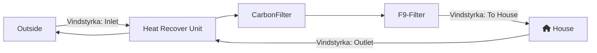

We recently installed Heat Recovery Ventilation (_WTW Ventilatie in Dutch_) combined with 2 filters; a carbon filter against odor and a fine dust (PM) filter. To know and monitor I installed 3 [IKEA Vindstyrka](https://www.ikea.com/be/en/p/vindstyrka-air-quality-sensor-smart-00498231/) Zigbee sensors within the ventilation pipes. 



### The flow



### Installation into the HVAC pipes

The biggest challange is to connect the USB-C cable through the pipes while keeping a good airtight seal. I installed T-junctions, with a cover to later access the Vindstyrka sensor. Don't forget to pair your devices (and maybe monitor them for a while) before installing! 

### Vindstyrka and pairing the sensors with Zigbee2Mqtt

The Ikea Vindstyrka's are very easy to pair with [Zigbee2Mqtt](https://www.zigbee2mqtt.io/devices/E2112.html#pairing), just `quickly press the top button 4x`. OTA updates are supported (but haven't seen any differences between versions).

Unfortunately the `precision` of all outputs is limited to whole numbers, which for `PM2.5`, `VOC` and `Humidity` is OK, but inconvenient for `temperature`. It's not a problem with the sensors, so maybe at a certain moment IKEA will come with a nice firmware update? 

The sensor is quite good, it's a [Sensiron SEN54](https://sensirion.com/products/catalog/SEN54/), with a precision of ±10% for mass concentration.

### Creating a nice dashboard in Home Assistant



Using [ApexCharts Card](https://github.com/RomRider/apexcharts-card) it's quite easy to create a good looking dashboard. 


```yaml
type: custom:apexcharts-card
graph_span: 24h
show:
  last_updated: true
yaxis:
  - id: pm25
    apex_config:
      forceNiceScale: true
      tickAmount: 7
color_list:
  - '#ff9800'
  - '#3498db'
  - '#e74c3c'
  - '#1a4c6e'
header:
  show: false
series:
  - entity: sensor.system_wtw_air_quality_inlet_pm25
    name: Inlet PM2.5
    type: line
    group_by:
      func: max
      duration: 5m
    stroke_width: 2
    show:
      header_color_threshold: true
    yaxis_id: pm25
  - entity: sensor.system_wtw_air_quality_to_house_pm25
    name: To House PM2.5
    type: line
    group_by:
      func: max
      duration: 5m
    stroke_width: 2
    show:
      header_color_threshold: true
    yaxis_id: pm25
  - entity: sensor.system_wtw_air_quality_outlet_pm25
    name: Outlet PM2.5
    type: line
    group_by:
      func: max
      duration: 5m
    stroke_width: 2
    show:
      header_color_threshold: true
    yaxis_id: pm25
```


### Conclusion

As you can see I see the filters are working very well, reducing unhealthy background finedust and especially handling peaks of woodburning neighbours. 

##### Further reads

- [Unravelling the secrets of IKEA's VINDSTYRKA](https://home-assistant-guide.com/news/2023/03/23/unraveling-the-secrets-of-ikeas-vindstyrka/)
- [Ikea Vindriktning Air Quality Sensor Review and Accuracy](https://www.airgradient.com/blog/ikea-vindriktning-accuracy/) containing some critisism on the thresholds (which I'm not using) and the accuracy. 