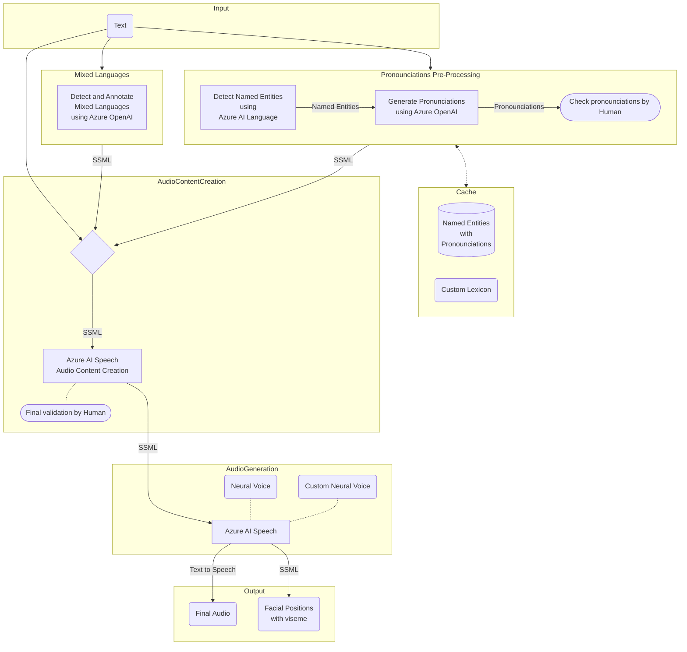

[Azure AI Speech](https://azure.microsoft.com/en-us/products/ai-services/ai-speech), a cloud-based service offered by Microsoft Azure, has been at the forefront of [Text-to-Speech (TTS)](https://learn.microsoft.com/en-us/azure/ai-services/speech-service/text-to-speech) capabilities. Text-to-Speech technology has come a long way from its early, often robotic-sounding, iterations. With advancements in deep learning and neural networks, AI has played a pivotal role in refining the naturalness and expressiveness of synthesized voices. Azure Speech employs Neural Text-to-Speech (Neural TTS), a cutting-edge technology that utilizes deep neural networks to model the complex patterns and nuances of human speech. This approach enables the synthesis of high-quality, natural-sounding voices that closely mimic the cadence, intonation, and rhythm of human speech. 

While the results are generally very good sometimes there are some challenges with person- and location- names in Dutch. Luckily Azure AI Speech supports [fine-tuning speech output with Speech Synthesis Markup Language (SSML)](https://learn.microsoft.com/en-us/azure/ai-services/speech-service/speech-synthesis-markup). 

### The flow

We are going to pre-process our text file, detect Named Entities using Azure AI Language and generate pronounciations using Azure OpenAI for these. In the next step we will use the generated SSML inside the Azure AI Speech Audio Content Creation studio before finally generating the audio.

The workflow starts with input text, goes through a comprehensive process of named entity detection, pronunciation generation, and SSML creation, and finally results in the synthesis of audio with associated visual representations. The involvement of human validation steps ensures a high-quality output in terms of both pronunciation and SSML content. The cached data in the database provides a valuable resource for future reference or improvements.

### Pre-processing 

Pre-processing text before transforming it into synthesized speech is a critical step to ensure natural-sounding and contextually accurate output. Azure AI Language and Azure OpenAI play integral roles in enhancing this pre-processing phase, along with the incorporation of custom lexicons.

#### Pronounciations

__Detect Named Entities using Azure AI Language__: [Azure AI Language Named Entity Recognition (NER)](https://learn.microsoft.com/en-us/azure/ai-services/language-service/named-entity-recognition/overview) is employed to detect entities like persons, organizations, locations, and more. This capability is crucial because likely most errors are made when pronouncing these.

__Generate Pronunciations using Azure OpenAI__: [Azure OpenAI](https://learn.microsoft.com/en-us/azure/ai-services/openai/) is utilized to generate pronunciations for the identified named entities. 

__Cache__: save and reuse entities and pronounciations. Azure AI Speech has native support for loading [Lexicons](https://learn.microsoft.com/en-us/azure/ai-services/speech-service/speech-synthesis-markup-pronunciation#custom-lexicon-file-examples) from blob storage. 

#### Language Detection

__Detect and Annotate Mixed Languages using Azure OpenAI__: Detecting and annotating mixed languages is a complex linguistic task that [Azure OpenAI](https://learn.microsoft.com/en-us/azure/ai-services/openai/) adeptly addresses. Azure OpenAI excels in discerning and annotating instances where multiple languages coexist within a given text. 

Unfortunately [Azure AI Language: Language Detection](https://learn.microsoft.com/en-us/azure/ai-services/language-service/language-detection/overview) only returns the main language so it's less suitable for this use.

### Audio Content Creation

__Azure AI Speech Audio Content Creation__: The [Azure AI Speech: Audio Content Creation](https://learn.microsoft.com/en-us/azure/ai-services/speech-service/how-to-audio-content-creation) [demo](https://speech.microsoft.com/audiocontentcreation) serves as a dynamic studio for crafting high-quality audio content by seamlessly integrating Speech Synthesis Markup Language (SSML) into the audio creation process. Users can harness its capabilities to fine-tune various aspects of synthesized speech, including pitch, rate, and volume, allowing for a nuanced and customized auditory experience. The Audio Content Creation tool is ideal for a final validation by a human.

### Audio Generation

__Azure AI Speech__: [Azure AI Speech](https://azure.microsoft.com/en-us/products/ai-services/ai-speech) will take our previously generated SSML and generate audio and potentially an [Avatar](https://learn.microsoft.com/en-us/azure/ai-services/speech-service/text-to-speech-avatar/what-is-text-to-speech-avatar) from this, either using the built-in voices or using the [Custom Neural Voice](https://learn.microsoft.com/en-us/azure/ai-services/speech-service/custom-neural-voice).

## Conclusion

While Azure AI Speech is already very powerful, the ability to customize using SSMLs make it a fit for all solution. By initiating the process with pre-processing, leveraging Azure AI Language to detect named entities, and utilizing Azure OpenAI to generate accurate pronunciations, we establish a foundation for natural and contextually aware speech synthesis. The seamless transition from text processing to SSML integration and, ultimately, audio generation underscores the adaptability and power of the Azure AI ecosystem. 

