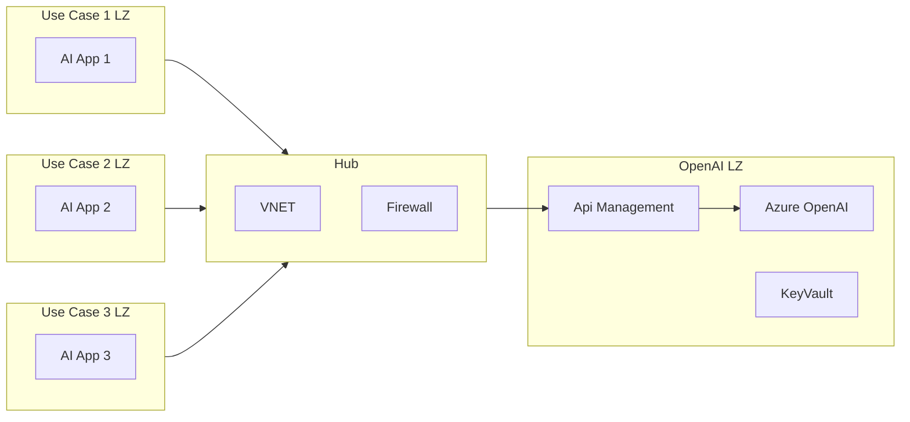
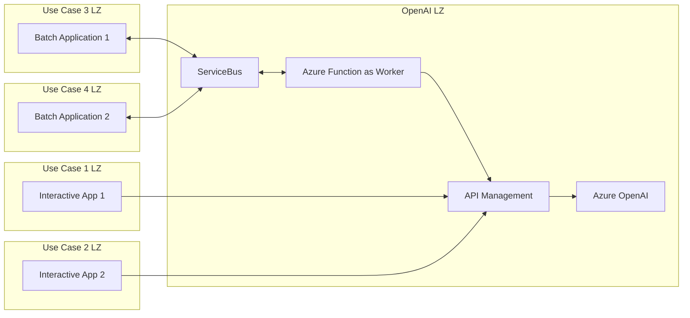
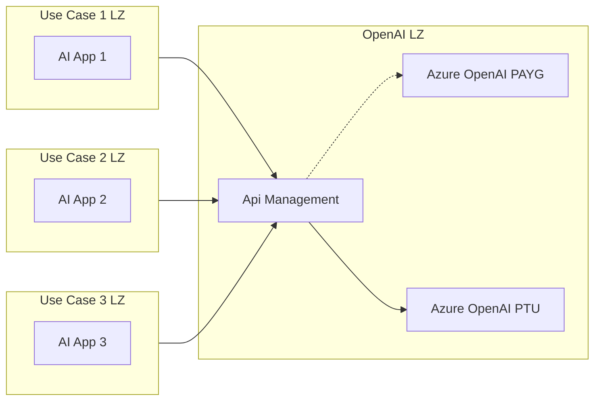

[Azure OpenAI Service](https://azure.microsoft.com/en-us/products/ai-services/openai-service) is a cloud-based platform that allows you to access and deploy powerful AI models based on OpenAI technologies, such as GPT-4. In this post, we will explore how to use the [provisioned throughput](https://learn.microsoft.com/en-us/azure/ai-services/openai/concepts/provisioned-throughput) (PTU) feature of Azure OpenAI Service, and how to design architectures for scalable and multi-application scenarios that leverage Large Language Models (LLMs).

#### Contents

- [What is provisioned throughput?](#what-is-provisioned-throughput)
- [How to design architectures for multi-application scenarios](#how-to-design-architectures-for-multi-application-scenarios)
- [Combining Interactive and Batch Applications](#combining-interactive-and-batch-applications)
- [Scaling out Azure OpenAI by combining PTU with PAYG](#scaling-out-azure-openai-by-combining-ptu-with-payg)

> ##### TIP
>
> The diagrams in this post are simplifications, take a look at the links within the document for more detailed architectures. 

### What is provisioned throughput?

Provisioned throughput is a feature of Azure OpenAI Service that lets you specify the amount of model processing capacity you need for your deployments. The service then allocates and reserves the necessary resources for you, ensuring consistent performance and availability.

Provisioned throughput is measured in terms of provisioned throughput units (PTU), which are units of model processing capacity that you can purchase and deploy. Each model and version requires a different amount of PTU to deploy and provide a certain level of throughput. For example, deploying GPT-4 version 0613 requires 100 PTU per deployment, and each PTU can process up to 10 tokens per second.

Provisioned throughput is different from the pay-as-you-go (PAYG) option, where you are charged based on the number of tokens you consume. With provisioned throughput, you pay a fixed monthly fee for the PTU you purchase, regardless of how much you use them. This can be more cost-effective for high-throughput workloads, and also provides predictable performance and latency.

## How to design architectures for multi-application scenarios

While the provisioned throughput feature offers many advantages, such as predictable performance and cost savings, however not all use cases in an organization will require a dedicated Azure OpenAI PTU instance. I see some patterns emerging where a single instance is shared between many use cases. Multiple applications connecting through a `Hub and Spoke` network to the Azure OpenAI landing zone. The OpenAI service is not directly exposed, Azure API Management is in front. 

#### Multi Application Architecture

#### Hub and Spoke

A [hub and spoke](https://learn.microsoft.com/en-us/azure/cloud-adoption-framework/ready/azure-best-practices/hub-spoke-network-topology) network topology is a common design pattern for cloud architectures, especially when multiple applications need to access a shared service or resource. By creating a central hub that hosts the networking (vnets, firewalls), each application is only connected to the central hub through vnet peering so one can achieve good isolation. The hub and spoke model simplifies the network management and security, as the hub can act as a single point of control and inspection for the traffic between the spokes. A Landing Zone is a focused area that houses specific resources, typically each Landing Zone is a Spoke.

The Azure OpenAI instance is hosted in one of the dedicated Landing Zones, the applications will be in different Landing Zones. There is a [Azure OpenAI Landing Zone reference architecture
](https://techcommunity.microsoft.com/t5/azure-architecture-blog/azure-openai-landing-zone-reference-architecture/ba-p/3882102)

#### The OpenAI Landing Zone

The Azure OpenAI Landing Zone contains Azure OpenAI and [Azure API Management](https://azure.microsoft.com/en-us/products/api-management/). By using Azure API Management in front of the Azure OpenAI service, you can apply policies, such as authentication, throttling, caching, and transformation, to your APIs. Additionally, you can monitor and analyze the performance and usage of your APIs using Azure API Management’s built-in analytics. This comes in very handy to split costs between multiple applications making use of OpenAI, take a look at [Calculating Charge backs for Business Units/Projects Utilizing a Shared Azure OpenAI Instance](https://techcommunity.microsoft.com/t5/apps-on-azure-blog/calculating-chargebacks-for-business-units-projects-utilizing-a/ba-p/3909202). Azure API Management can easily mimic the Azure OpenAI API, so it remains compatible with existing OpenAI clients. 

Azure API Management connects to the [Azure OpenAI private endpoint](https://learn.microsoft.com/en-us/azure/ai-services/cognitive-services-virtual-networks), keeping all traffic internal. 

Azure API Management can protect the OpenAI API using [OAuth 2.0 authorization with Microsoft Entra ID](https://learn.microsoft.com/en-us/azure/api-management/api-management-howto-protect-backend-with-aad). The [Azure OpenAI Architecture Patterns and implementation steps
](https://techcommunity.microsoft.com/t5/ai-azure-ai-services-blog/azure-openai-architecture-patterns-and-implementation-steps/ba-p/3979934#:~:text=AOAI%20with%20APIM,-Architecture%20diagram%3A) contains good guidance on Authentication and Monitoring.

#### Application Landing Zones

Proper architecture prescribes dedicated landing zones for separate applications, see the [Azure landing zones for modern application platforms](https://learn.microsoft.com/en-us/azure/cloud-adoption-framework/scenarios/app-platform/ready) guidance.

#### Templates 
- [nicolegit/hub-and-spoke-playground](https://github.com/nicolgit/hub-and-spoke-playground/blob/main/scenarios/aoai.md)
- [microsoft/AzureOpenAI-with-APIM](https://github.com/microsoft/AzureOpenAI-with-APIM)

## Combining Interactive and Batch Applications

One of the challenges of using provisioned throughput is that it allocates a fixed amount of capacity for your applications, regardless of the actual demand. This means that you might have spare capacity during periods of low activity, such as at night or on weekends. To optimize the utilization of provisioned throughput, you need to design your applications to adapt to the fluctuations in demand.

In this architecture, I suggest a hybrid approach that combines interactive and batch applications. Interactive applications are those that require immediate responses from the Azure OpenAI service, such as chatbots or web apps. Batch applications are those that can tolerate some delay in processing, such as data analysis or reporting. Interactive applications are directly connected to the Azure OpenAI landing zone, making use of the hub and spoke network topology described above. Batch applications, on the other hand, use [Azure Service Bus](https://azure.microsoft.com/en-us/products/service-bus/), a fully managed cloud messaging service, to communicate with the Azure OpenAI service.

#### Azure Service Bus and Azure Functions

Azure Service Bus allows you to send and receive messages between decoupled applications and services. By using Azure Service Bus, you can implement a queue-based load leveling pattern, which buffers requests from batch applications and sends them to the Azure OpenAI service when the provisioned throughput is available. This way, you can balance the load between interactive and batch applications, and avoid overloading the Azure OpenAI service during peak hours. 

[Azure Functions](https://azure.microsoft.com/en-us/products/functions/) (but also [Logic Apps](https://azure.microsoft.com/en-us/products/logic-apps/)) provides seamless integration with Azure Service Bus, enabling you to create functions that react to and send messages to queues or topics. One of the use cases for Azure Functions and Service Bus is to call the Azure API Management (and Open AI) and respond back on the Service Bus with the Open AI reply. 

## Scaling out Azure OpenAI by combining PTU with PAYG

Scaling out Azure OpenAI by combining PTU with Pay-as-you-go (PAYG) is a strategy to optimize the utilization and cost of the Azure OpenAI service. The Pay-As-You-Go model uses tokens-per-minute(TPM) that you can consume on demand and pay per usage. By combining PTU and PAYG, you can balance the load between your reserved and on-demand capacity, and handle peak demand or spillover scenarios.

The [Azure OpenAI Using PTUs/TPMs With API Management - Using the Scaling Special Sauce](https://github.com/Azure/aoai-apim/tree/main?tab=readme-ov-file#azure-openai-using-ptustpms-with-api-management-------using-the-scaling-special-sauce) contains a good write-up and more details.

## Conclusion

In this article, we have explored how to design and implement a scalable and secure architecture for using Azure OpenAI service in multiple applications. We have seen how to use the hub and spoke network topology to connect different applications to a single OpenAI instance, and how to use Azure API Management to manage and secure the access to the OpenAI service. We have also learned how to combine interactive and batch applications, and how to use Azure Service Bus to enable asynchronous communication and load balancing. Moreover, we have discussed how to optimize the utilization and cost of the Azure OpenAI service by combining provisioned throughput units (PTUs) and tokens-per-minute (TPMs), and how to handle peak demand or spillover scenarios. By using these Azure services and strategies, we can leverage the power of Azure OpenAI models while maintaining a high level of performance, security, and observability.