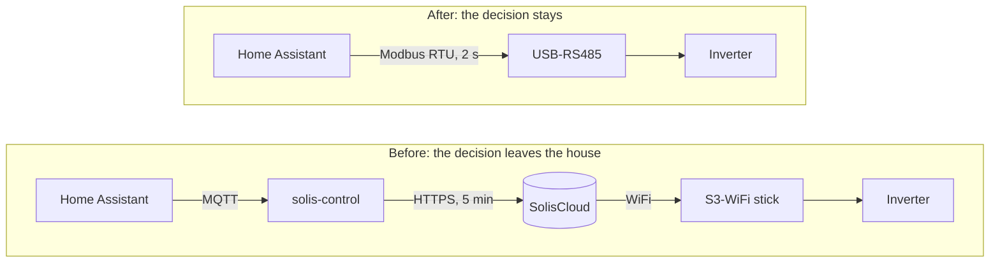

Two weeks ago my solar battery was steered from a datacentre I have never seen, run by a company I have no contract with, over an API I do not pay for and cannot hold to any SLA. Every time my house decided "charge now, the capacity peak is about to break", that decision travelled from Belgium to SolisCloud and back before anything happened in my garage.

Today the same decision is a write to holding register `43018` over a €15 USB-to-RS485 adapter, on a two-metre twisted pair, at 9600 baud.

The inverter is the same inverter. Same [Ginlong](https://www.ginlong.com/) RHI-5K-48ES-5G, same firmware, same Chinese factory. The batteries are still Pylontech. The FTDI chip in the adapter still comes from a supply chain in which I am a rounding error. **Not one thing about my dependency changed.** What changed is who gets to decide.

That gap — between *dependency*, which you mostly cannot escape, and *dependence*, which you very much can — is the entire sovereignty argument. It is the argument I'm having at home with a soldering iron, and the argument I'm having at [Scrydon](https://scrydon.com/) with enterprises who think sovereignty means building their own GPUs. Most people conflate the two, conclude that sovereignty is impossible, and stop thinking.

I should declare my interest early: I'm CEO of Scrydon, and a sovereign [AI OS](/tags/ai-os) is what we build. So read the second half as a practitioner's argument, not a neutral survey. The first half is just a man with a multimeter.

## The setup, briefly

The plant is a Solis RHI-5K-48ES-5G hybrid inverter, a Pylontech LV stack (US5000 + US3000C), and solar on the roof. All of it is driven by [Home Assistant](/tags/home-assistant) on [NixOS](/tags/nixos), declaratively, in [a public repo](https://github.com/nathan-gs/nix-conf/tree/main).

Until August it talked to the world through an S3-WiFi-ST logging stick plugged into the inverter's 4-pin COM port. That stick did two things: it shipped telemetry up to SolisCloud, and it was the only path by which anything could change a setpoint. Home Assistant read the battery through the `solis-sensor` cloud integration and wrote to it via a small service called `solis-control`, which spoke MQTT on my side and the SolisCloud API on the other.

It worked. For three years, it mostly worked.

## What "mostly worked" actually cost

Once you write the bill down, it's uglier than it feels day to day:

- **Five-minute samples.** SolisCloud gave me a battery state-of-charge every five minutes. My car charger ramps in seconds. My heat pump modulates in seconds. I was running a control loop on data that could be five minutes stale, and I had built rate limits and hysteresis around that staleness as if it were a law of physics rather than someone's API tier.
- **Writes that sometimes didn't.** A setpoint change was a request to a remote service. Sometimes it failed. Sometimes it succeeded and took minutes to reach the hardware. My automations carried retries because a company's uptime had become my house's uptime.
- **Capabilities the app simply didn't expose.** Register `43110` bit 5 — "allow charging from the grid" — was off. There was no way to reach it from the cloud side. Solar-only top-up stalls around 90–95 % as PV fades, and there was nothing I could do about it, because the vendor had decided which of my inverter's own functions I was allowed to use.
- **A single point of "and then what?"** If Ginlong deprecated the API, geofenced it, moved it behind a subscription, or was simply acquired by someone with different ideas, my battery would keep storing electricity and stop being *steerable*. The hardware would be physically fine and functionally lobotomised. There is no legal remedy for that. There is no support ticket for that.

None of this is a story about a villain. SolisCloud was never malicious. It was just someone else's computer that happened to hold the only key to mine.

## The switch

The fix turned out to be embarrassingly physical. The RHI-5G speaks the ESINV-33000 Modbus register map on that same 4-pin COM connector the WiFi stick was using. Everything SolisCloud was showing me — and everything it was letting me set — is a register on a bus in my own garage:

| What | Register |
|---|---|
| Battery SoC / SoH | `33139` / `33140` |
| Battery power | `33149`–`33150` |
| House load | `33147` |
| PV strings | `33049`–`33052` |
| Charge / discharge energy | `33161`–`33168` |
| Overdischarge SoC (the floor) | `43011` |
| Force-charge SoC | `43018` |
| Max grid W while force-charging | `43027` |
| Storage mode + allow-grid-charge bit | `43110` |

The cloud "CIDs" that `solis-control` had been POSTing to SolisCloud map **one to one** onto those holding registers. CID 158 is register 43011. CID 160 is 43018. CID 9020 is 43027. The cloud was never doing anything clever. It was a very slow, very fragile, internet-shaped proxy for a serial cable.

So: [`Pho3niX90/solis_modbus`](https://github.com/Pho3niX90/solis_modbus) vendored into the NixOS config the same way as any other custom component, the `hass` user added to `dialout`, a USB-RS485 adapter on pins 2/3/4 of the COM socket (never pin 1 — that's +5 V and it will fight the inverter's PSU), and the WiFi stick in a drawer.

The whole trust boundary moved from *the internet* to *a cable I can see*.

## Sovereignty was not a tax. It was a dividend.

This is the part I did not expect, and it's the part that matters most for the enterprise argument.

The usual framing is that sovereignty costs you something — that you trade capability for independence, that the local option is the worse option you accept on principle. That is not what happened:

- **Polling went from 5 minutes to 2 seconds.** Not 150× more data for its own sake; 150× more *control authority*. I can now write automations that were previously nonsense, like "keep force-charging until SoC has been at 100 % for fifteen minutes" — a genuine closed loop instead of setting a floor and hoping.
- **Register `43110` bit 5 became reachable.** The grid-charge capability the cloud hid from me is a `select` entity now. That single bit is the difference between a battery that stalls at 92 % and one that finishes.
- **Real energy accounting replaced a linear guess.** I used to estimate battery charge/discharge kWh from SoC deltas at a fixed 83 Wh/%, because that's all the cloud gave me. Registers `33161`–`33168` are the inverter's own BMS-tracked counters. The estimate is gone.
- **The write path stopped failing.** No cloud lag in the loop, no retry logic wrapped around someone else's availability.

Local control was better on every axis I care about. That's not a coincidence and it's not luck — it's what happens when you delete a 5,000 km round trip from a control loop. **Latency and sovereignty are the same property viewed from two angles.**

## The honest ledger

I don't want to sell this as free, because it wasn't, and the enterprise version isn't either.

**What it cost.** The two RS-485 buses on that inverter must never be mixed — the 4-pin COM is yours, the 2-pin meter pair belongs to the inverter, and putting a second master on the meter bus glitches self-use. A and B are swapped on half the cheap dongles. And the part that took by far the longest: three years of energy history lived under the cloud entities' statistics IDs, so migrating meant splicing thirteen cumulative kWh counters and seven power series directly into the new entities' rows in MariaDB — computing a sum offset per counter, verifying each series only had genuine resets rather than corruption, `mysqldump` first, and checking afterwards that the last imported row and the first naturally-compiled row landed on the same value. **The migration cost was almost entirely history and lock-in, not technology.** That is always where it is.

**What I gave up.** SolisCloud firmware OTA. The installer's remote access. The vendor app. Those are real losses and I chose them deliberately — which is the point. It was a decision I got to make, on a ledger I could see, rather than a term someone changed in a document I never read.

**What I did not gain.** Anything at all resembling independence from China. Ginlong still wrote that firmware. Pylontech still made those cells. If the RHI-5K dies out of warranty I am buying another inverter from a supply chain with no European option at my price point, and I know it.

## Dependency is not dependence

Here is the distinction, as plainly as I can put it.

|  | **Dependency** | **Dependence** |
|---|---|---|
| What it is | You did not make it and cannot make it | Someone else decides how you use it |
| My inverter | Chinese hardware, Chinese firmware | *(removed)* |
| Escape route | Basically none | A serial cable |
| The real question | Where was it built? | Who can turn it off? |

You cannot fab your own silicon. You cannot smelt your own lithium. You are not going to build an EUV lithography machine in Flanders, and pretending otherwise is how sovereignty debates turn into theatre. **Supply chain dependency is, for almost everyone, unavoidable.**

Control is a different game entirely. Control is about where the decision is made, who holds the keys, and what happens on the day the terms change. And control is *cheap* by comparison — mine cost fifteen euros and a weekend.

The failure mode I keep seeing is people who conflate the two, correctly conclude that the first is hopeless, and therefore give up on the second. That's precisely backwards. The unavoidable dependency is the reason to be ruthless about the avoidable dependence, not an excuse to accept it.

## The same argument, four orders of magnitude larger

I run this house the way I do partly because it's a fair test rig for what we build at Scrydon.

Enterprises are having exactly this argument right now, and mostly having it in the wrong frame. The board asks "can we get off the American hyperscalers, off the American models?" — an all-or-nothing question whose honest answer is *no, not entirely, not soon*. Nvidia is not a European company. The frontier models are mostly not European. So the conversation stalls, the organisation concludes sovereignty is a fantasy, and someone signs the renewal.

But that's the supply-chain question, and it's the wrong one to start with. The question that actually decides whether you are sovereign is the one I asked about my inverter:

**When the vendor changes the terms, what stops working — and how fast?**

The European Commission's Cloud Sovereignty Framework — which is what our [Cloud Sovereignty Score](https://scrydon.com/sovereignty/score/cloud) calculator implements — gets this right, and the weights are the interesting part. Across the eight objectives, *Supply Chain Sovereignty* (SOV-5) carries **10 %**. *Operational Sovereignty* (SOV-4) carries **15 %**, *Technology Sovereignty* (SOV-6) another **15 %**, and *Strategic Sovereignty* (SOV-1) the largest share at **20 %**. Where the transistor was fabricated is explicitly *not* the dominant term. Who runs the thing, who can change it, and whether you could ever leave — those are.

It's worth running your own estate through it honestly, at SEAL levels 0 through 4, and looking at where the points actually leak. In my experience the score is rarely dragged down by hardware nobody can source in Europe. It's dragged down by the control plane nobody thought to ask about — the console that only exists in someone else's cloud, the model endpoint that can be deprecated with 90 days' notice, the audit log you can read but not hold.

It's the WiFi stick, at enterprise scale.

## What we actually claim

We don't claim Scrydon eliminates dependency. We didn't build the accelerators and we didn't train every model, and any vendor telling you otherwise is selling you a flag rather than an architecture.

What a [sovereign AI OS](https://scrydon.com/platform/ai-os/) claims is narrower and much more useful: the governance kernel, the context layer, the process and workflow scheduler, and the integrations run **where you decide** — air-gapped, on-premise, or in a European cloud — under keys you hold, with an audit trail you own, and with the models underneath swappable rather than load-bearing. The dependency stays. The dependence goes. Same trade as my garage, same shape, more zeros.

That last property is the one doing most of the work. A model you can replace in an afternoon is a supplier. A model your processes have quietly grown around — whose specific behaviour your prompts, evaluations and integrations are now shaped to — is a landlord. The difference has nothing to do with which country trained it, and everything to do with whether you kept the layer above it yours.

## Three questions

Whether you're auditing a home battery or an AI platform, the same three questions separate a dependency you can live with from a dependence you can't:

1. **If the vendor's API vanished tomorrow, what stops working — and how long until it does?** For my inverter the answer used to be "all steering, on the first failed write." Now it's "nothing."
2. **Where does the decision get made?** In a control loop you own, or on a round trip to someone else's datacentre? Latency is the tell. If the answer is measured in hundreds of milliseconds crossing a border, you've found your dependence.
3. **Who holds the keys and the logs?** Not who can *view* them. Who can *hold* them when the relationship ends.

Answer those three honestly. It won't get you out of the supply chain — nothing will. But it tells you exactly where you're renting your own operations back from someone else, and roughly what a serial cable would cost.

Mine was fifteen euros.
